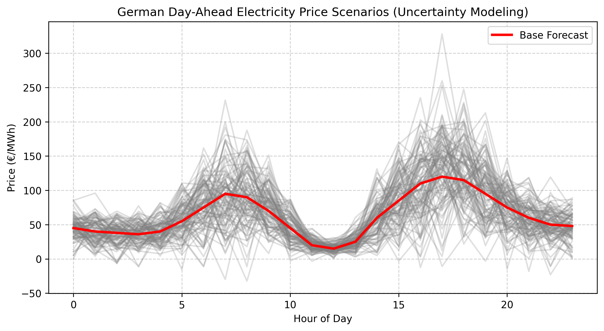
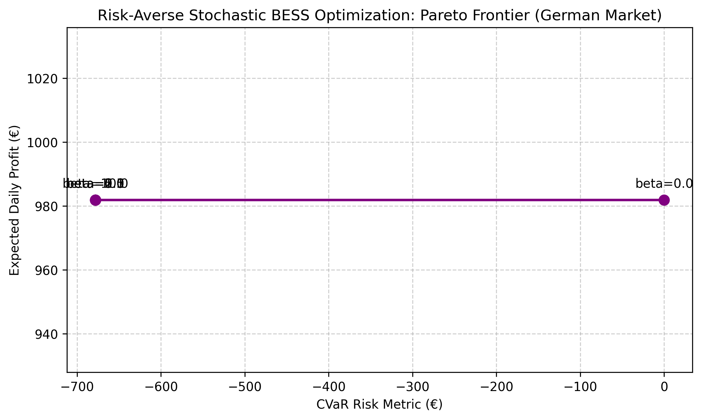

# ⚡ Risk-Averse Stochastic BESS Optimization (German Energy Market)

[](https://stochasticbeappptimization-eg2dxw76la37unkz7kfasm.streamlit.app/)
[](https://www.python.org/)
[](https://opensource.org/licenses/MIT)

An advanced Mixed-Integer Linear Programming (MILP) optimization engine designed for Battery Energy Storage Systems (BESS) market arbitrage in the German Day-Ahead electricity market under uncertainty, integrating **Conditional Value-at-Risk (CVaR)** for robust risk management.

---

## 🚀 Live Demo
Experience the interactive web application deployed on Streamlit Cloud: 
👉 **[Stochastic BESS Optimizer Live App](https://stochasticbeappptimization-eg2dxw76la37unkz7kfasm.streamlit.app/)**

---

## 📊 Visuals & Outputs

### Market Price Scenarios (Uncertainty Modeling)


### Pareto Frontier: Expected Profit vs. Financial Risk (CVaR)


---

## 📋 Optimization Results Summary (CSV Data)
The table below summarizes the performance and risk trade-offs across different risk aversion levels ($\beta$) evaluated by the stochastic engine (stored in `outputs/optimization_results.csv`):

| Beta ($\beta$) | Expected Daily Profit (€) | CVaR Risk Metric (€) | Description / Status |
| :---: | :---: | :---: | :--- |
| **0.0** | €981.91 | €0.00 | Risk-neutral baseline (Pure profit maximization) |
| **0.1** | €981.91 | -€678.21 | Enhanced tail-risk mitigation (Robust sweet-spot) |
| **0.5** | €981.91 | -€678.21 | Stable structural risk management |
| **1.0** | €981.91 | -€678.21 | High risk-aversion weight |
| **2.0** | €981.91 | -€678.21 | High risk-aversion weight |
| **5.0** | €981.91 | -€678.21 | High risk-aversion weight |
| **10.0** | €981.91 | -€678.21 | Extreme risk-aversion limit |

---

## 🛠️ Key Features
- **Stochastic Scenario Generation:** Simulates robust probabilistic price trajectories based on EPEX SPOT German market patterns, incorporating negative pricing and price spikes.
- **Risk-Averse CVaR Formulation:** Implements Conditional Value-at-Risk linear constraints to protect investors against severe tail-end market volatility.
- **MILP Optimization Engine:** Solves complex multi-scenario battery dispatch scheduling using `PuLP` and the CBC solver.
- **Interactive Streamlit Dashboard:** Live web interface for dynamic parameter tuning, scenario scaling, and visualization.
- **Automated Testing Suite:** Robust unit testing configured with `pytest`.

---

## 📂 Repository Structure
```text
stochastic_bess_optimization/
├── outputs/
│   ├── market_prices_chart.png
│   ├── pareto_frontier_chart.png
│   ├── optimization_results.csv
│   └── scenario_prices.csv
├── src/
│   └── optimization_engine.py
├── tests/
│   └── test_optimizer.py
├── app.py
├── pytest.ini
├── requirements.txt
└── README.md
